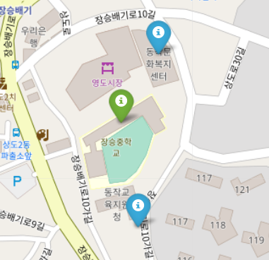
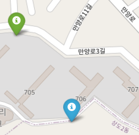
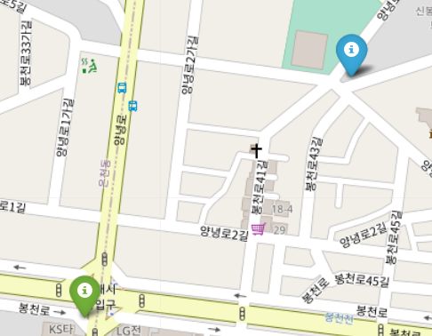

## School Exploratory Data Analysis (학교 데이터 분석)

### 서울시 민방위대피소 관련 데이터를 사용해 전쟁시 가장 효율적인 대피방법 찾아보기

#### 사용하는 데이터: 서울시 민방위대피소(http://data.seoul.go.kr/dataList/OA-21067/S/1/datasetView.do)
 

#### 학교에서의 대피소 결정

1. 가장 가까운 대피소

    - 동작관악교육지원청
    - 동작문화복지센터
 

2. 두 대피소 비교

    ||동작관악교육지원청|동작문화복지센터|
    |------|------|-----|
    |인원수|456 명|4121|
    |면적|470 명|3400|
 

3. 결론

    동작문화복지센터는 인원과 면적이 동작관악교육지원청 보다 압도적으로 크기 때문에 더 많은 사람을 받을 수 있다. 즉, 다른 사람들과 같이 움직이기 용이하다.
     
    그래서 전쟁이 나면 선생님들께서 후문을 열어주시면 동작문화복지센터로 가야겠다.
 

#### 집에서의 대피소 결정

1. 가장 가까운 대피소

    - 신동아 리버파크(내가 사는 아파트) 지하
 

2. 결론

    우리집에서는 지하 주차장으로 도망가야한다.

#### 학원에서의 대피소 결정

1. 가장 가까운 대피소

    - 신봉 아파트 101동
 

2. 거리 확인
    
    - 내가 다니는 학원에서 대피소까지의 거리는 다른 집이나 학교에 비해 멀어서 거리를 확인해보았다. 
    -> 약 318이다.
 

3. 결론
    
    - 학원에서는 문에서 나와서 1시 방향에 있는 신봉 아파트 101동으로 가야한다.
